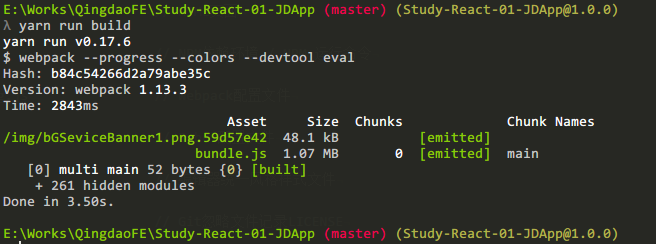

# Study-React-01-JDApp

> 学习-React-第一节-模仿京东APP页面
>
> 本页面需要在服务器环境下通过域名访问,勿直接浏览静态页面

## 特别说明： 本项目采用Sass作为样式预处理器语言,并且引入本人自己的一个小型Mixin库(可自由向内添加自定义Mixin)
> 如果开发者不需要Sass作为开发语言或者想要更换样式预处理语言有以下两种方式解决：
>
> 1. 不需要Sass等预处理语言——删除package.json文件上的`node-sass`与`sass-loader`选项，将组件的样式以单独`CSS`文件夹的方式引入组建当中
>
> 2. 不需要Sass等预处理语言——删除package.json文件上的`node-sass`与`sass-loader`选项，按照React推荐的方式，在组件内以`inline style`的方式来写样式
>
> 3. 更换预处理语言——删除package.json文件上的`node-sass`与`sass-loader`选项，去网上找 `React + Less` 或者 `React + stylus`等配置方法.
>
> 4. 采用`css modules`方式来书写样式——详情自行查找解决方案

### 如果`Yarn`无法安装`node-sass`与`sass-loader`依赖,建议考虑采用`CNPM`替代`NPM`与`Yarn`方案
### 如果`CNPM`也无法安装依赖的情况,请检查自己的`nodejs`版本(推荐使用V4.5以上版本)
> 如果`Sass`依赖还是装不上,最终大招：
>
> 将你的样式文件编写在`src/style/sass`路径下，通过 `Ruby命令行`(gem安装Sass后),将`Sass`样式文件输出到`src/style/css`路径下。
>
> jsx组件内引用`src/style/css`文件夹内编译好的样式文件即可。

***
## 使用技术:
```bash
1. React             框架
2. Sass/Less         样式预处理器
3. Webpack           模块打包
4. Babel             ES6转译ES5工具
5. Yarn              模块依赖安装
6. ESlint            JSX/JS 语法检查工具
```

***

## Project structure / 项目结构
```bash
study-react-01-jdapp/
    |
    |- index.html                       // HTML页面
    |
    |- package.json                     // NPM依赖环境 / NPM 运行命令
    |
    |- webpack.config.js                // Webpack配置文件
    |
    |- .babelrc                         // Babel配置文件
    |
    |- .editorconfig                    // 编辑器统一风格样式文件
    |
    |- .gitignore                       // Git忽略文件记录LICENSE
    |
    |- LICENSE                          // 开源协议(禁止闭源使用本项目)data.json
    |
    |- data.json                        // 模拟数据文件.eslintrc.yml
    |
    |- .eslintrc.yml                    // ESLint语法检查 配置文件
    |
    |- dist/                            // 打包
    |
    |- src/                             // 开发
        |
        |- images/                      // 图片资源
        |
        |- components/                  // React组件
        |
        |- style/                       // Sass样式文件(包括第三方Mixin库)
        |
        |- index.js                     // React根组件
```

***

## Build Setup / 开发流程

``` bash
# install dependencies/拉取项目,在项目路径下执行
# 国内环境建议使用cnpm install
npm install

# *推荐Yarn
yarn install

# serve with hot reload at localhost:8080
# npm安装依赖后,运行node服务器,打开 localhost:80 预览 (已运行热更新功能)
npm run dev

# build for production with minification
# 当修改代码后,需要手动打包发布时,运行npm run build命令进行打包
npm run build
```

> 测试打包 `yarn run build`



```bash
master (主干: 建议不要在主干分支开发)
    |
    |_ Init         (初始分支-当重置项目时,可采用此分支)
    |
    |_ Sass         (预处理器为Sass的开发分支)

```

## 测试机器: iPhone 6s

## 测试浏览器: Chrome/Safari/FireFox/微信
